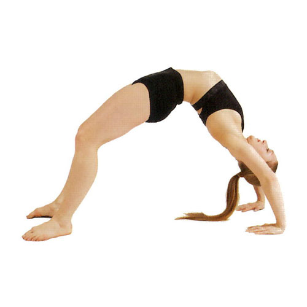
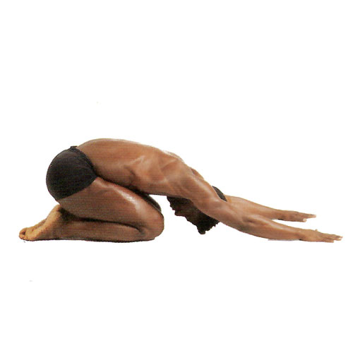
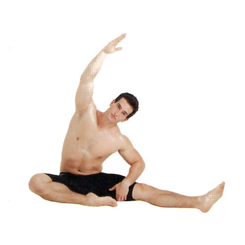
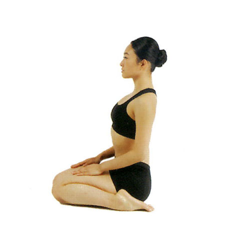
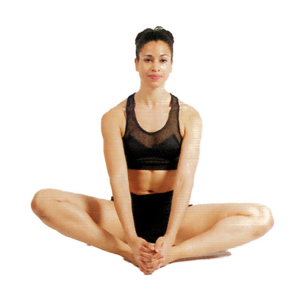
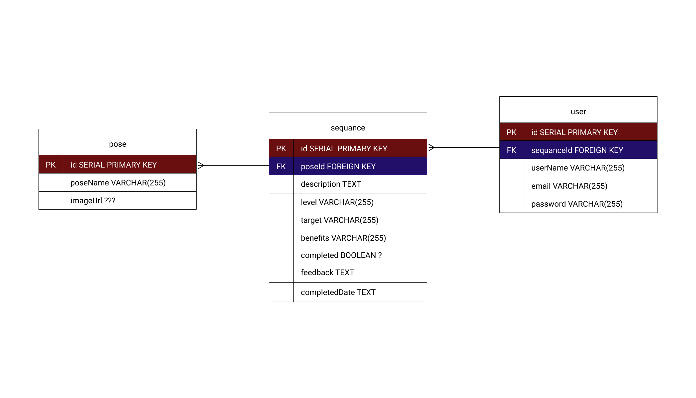
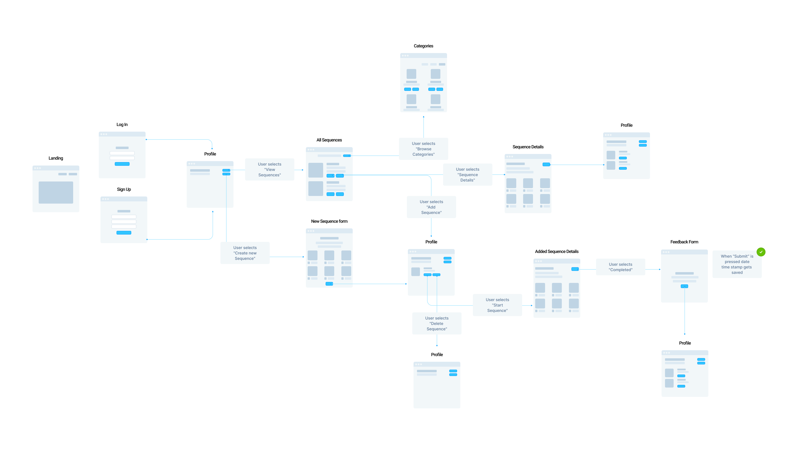

# Yoga WebApp

### Project Idea/Description 

Most software engineers have a sedentary lifestyle which can negativaly impact overall health. I have decided to turn my [yoga book](https://www.amazon.com/Ultimate-Guide-Yoga-Nancy-Hajeski/dp/1645170454) into a web application that I can use at anytime I want. Some of the benefits of yoga are - helps with stress relief, improves mental health, improves flexibility, may reduce anxiety, may boost immunity and much more!      

### Choice of API
I will make my own api from the content of the book. Specifically I scanned and cropped 161 unique poses which I plan to use for the api. This api will inlcude an image of a pose and name. In [this link](https://docs.google.com/spreadsheets/d/1Uwb7WTSapTxmTuSvQ31j1TeHQZ2Oq8bFsCsRnTsUYLA/edit?usp=sharing) you can see a reference to all the content from the book that I will use in my project.

#### Image Examples

My webapp will have "sequences" of yoga poses for ex: Beginner Sequence - 18 poses (Downward-Facing Dog, Warrior Pose I, Tree Pose...etc).

### ERDs

### Restful Routing Chart

| Method | Path | Purpose |
| ------ | -------------- | -------------------------------- |
| GET | `/` | home page of the website |
| GET | `/signup` | signup page of the website |
| POST | `/signup` | signup for the website |
| GET | `/login` | login page of the website  |
| GET | `/profile` | profile page of the website  |
| DELETE | `/sequence` | delete saved sequence from profile  |
| PUT | `/sequence` | edit saved sequence  |
| GET | `/categories` | sequence categories page of the website |
| POST | `/categories/:id` | add sequence to user profile |
| GET | `/categories/:id` |  sequence detail view page of the website |
| GET | `/new` | new sequence form page of the website |
| POST | `/new` | create new sequence form |
| PUT | `/completed/:sequenceId` | when sequence is completed update it to true in the database |
| GET | `/feedback/:sequenceId` | when completed feedback form will show on the website |
| POST | `/feedback/:sequenceId` | new sequence form page of the website |
| GET | `/beginner` | show all beginner sequences |
| GET | `/intermediate` | show all intermediate sequences |
| GET | `/advanced` | show all advanced sequences |

### Wireframes of all user views

### User Stories
* As a user, I want to sign up for a profile 
* As a user, I want to sign out of my profile 
* As a user, I want to add a yoga sequence to my profile so I can have it saved 
* As a user, I want to have only 4 added sequences to my profile so it won't clutter my profile
* As a user, I want to delete a sequence from my profile
* As a user, I want to create a new sequnce max of 24 poses so I can incorporate poses that are suitable for me 
* As a user, I want to log any feedback I have after my sequence 
* As a user, I want to click and browse through all 161 poses 
* As a user, I want to view sequence categories 

### MVP goals 
* sequences show up on the page
* can create a new sequence
* Authentication login/signup
* user can add sequnces to his profile
* user can delete sequences 
* mark as completed 
* feedback form 

### Stretch goals 
* categories page: beginner, intermediate, advanced 